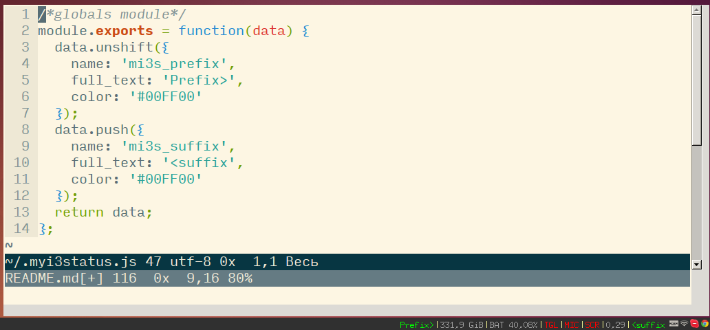

# my-i3status

node module for wrapping i3status 



## How to install

```sh 
npm i -g my-i3status
```

In **~/.i3status.conf** change output_format to "i3bar"

```
general {
  output_format = "i3bar"
}
```

In **~/.i3/config** change status_command:

```
bar {
  status_command my-i3status
}
```

Create **~/.myi3status.js** or [~/.myi3status/index.js](https://github.com/Bubujka/dotmyi3status/blob/master/index.js):

```js
module.exports = function(data) {
  data.unshift({
    name: 'mi3s_prefix',
    full_text: 'Prefix>',
    color: '#00FF00'
  });
  data.push({
    name: 'mi3s_suffix', 
    full_text: '<suffix', 
    color: '#00FF00'
  });
  return data;
};
```
